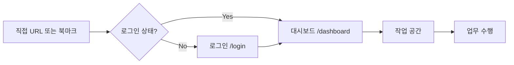

# 📄 WEAVE 페이지 구조 및 사용자 플로우

## 🏗️ 페이지 구조 (Page Structure)

### 1. 공개 페이지 (Public Pages) - 인증 불필요

| 경로 | 페이지명 | 설명 | 주요 기능 |
|------|---------|------|----------|
| `/` | 랜딩페이지 | 외부 유입 고객을 위한 마케팅 페이지 | 서비스 소개, 기능 설명, 고객 후기, CTA |
| `/home` | 홈 화면 | 서비스 메인 페이지 (로그인 전) | 빠른 시작 메뉴, 주요 기능 소개, 로그인/회원가입 버튼 |
| `/login` | 로그인 | 사용자 인증 페이지 | 이메일 로그인, 소셜 로그인, 비밀번호 찾기 |
| `/signup` | 회원가입 | 신규 사용자 등록 | 이메일 가입, 소셜 가입, 약관 동의 |
| `/auth/callback` | OAuth 콜백 | 소셜 로그인 처리 | 자동 리다이렉트 |

### 2. 보호된 페이지 (Protected Pages) - 인증 필요

| 경로 | 페이지명 | 설명 | 주요 기능 |
|------|---------|------|----------|
| `/dashboard` | 대시보드 | 로그인 후 메인 작업 공간 | 실시간 통계, 캘린더, 빠른 실행, 최근 활동 |
| `/clients` | 클라이언트 | 고객 관리 시스템 | 고객 목록, 고객 정보, 거래 내역, 사업자 조회 |
| `/projects` | 프로젝트 | 프로젝트 관리 | 프로젝트 목록, 진행 상황, 타임라인, 문서 |
| `/projects/new` | 프로젝트 생성 | 새 프로젝트 등록 | 프로젝트 정보 입력, 클라이언트 연결 |
| `/invoices` | 인보이스 | 청구서 관리 | 인보이스 목록, 생성, 발송, 결제 추적 |
| `/documents` | 문서 관리 | 문서 중앙 관리 | 문서 목록, 템플릿, 계약서, 자동 생성 |
| `/reminder` | 리마인더 | 일정 및 알림 관리 | 리마인더 설정, 알림 내역, 반복 설정 |
| `/tax` | 세무 관리 | 세무 도우미 | 세금 계산, 세무 상담, 신고 지원 |
| `/chat` | AI 챗봇 | AI 업무 비서 | 대화형 AI, 업무 지원, 질의응답 |
| `/settings` | 설정 | 시스템 설정 | 프로필, 보안, 알림, 연동, 결제 |

### 3. AI 통합 페이지 (AI-Integrated Features)

| 위치 | 기능명 | 설명 | 접근 방법 |
|------|--------|------|----------|
| `/chat` | AI 챗봇 | 대화형 AI 비서 | 직접 접근 또는 모든 페이지 하단 플로팅 버튼 |
| 각 페이지 내장 | RAG 시스템 | 문서 추출 및 생성 | 문서/인보이스 페이지 내 AI 버튼 |
| `/tax` 내장 | 세무 AI | 세무 상담 및 계산 | 세무 관리 페이지 내 상담 섹션 |
| 대시보드 위젯 | AI 인사이트 | 비즈니스 분석 | 대시보드 카드 형태 |

## 🔄 사용자 플로우 (User Flow)

### 1. 신규 사용자 여정 (New User Journey)


**상세 플로우:**
1. **랜딩페이지 진입** → 서비스 소개 확인
2. **홈 화면 이동** → 주요 기능 탐색
3. **회원가입 클릭** → 정보 입력 및 약관 동의
4. **이메일 인증** → 계정 활성화
5. **로그인** → 자격 증명 입력
6. **대시보드 진입** → 환영 메시지 및 가이드
7. **초기 설정** → 프로필, 사업자 정보 등록
8. **서비스 이용 시작** → 프로젝트 생성, 클라이언트 등록 등

### 2. 기존 사용자 여정 (Returning User Journey)



**빠른 접근 경로:**
- **북마크 접근** → 자동 로그인 → 대시보드
- **랜딩/홈에서 로그인** → 대시보드 직행
- **특정 페이지 URL** → 로그인 → 해당 페이지로 자동 이동

### 3. 주요 업무 플로우 (Work Flows)

#### 3.1 프로젝트 생성 플로우
```
대시보드 → 새 프로젝트 버튼 → 프로젝트 정보 입력 → 클라이언트 선택 → 저장 → 프로젝트 상세 페이지
```

#### 3.2 인보이스 발행 플로우
```
프로젝트 페이지 → 인보이스 생성 → 항목 입력 → AI 자동 생성 → 미리보기 → 발송 → 결제 추적
```

#### 3.3 AI 업무 지원 플로우
```
어느 페이지든 → AI 챗봇 버튼 → 질문 입력 → AI 응답 → 작업 수행 → 결과 저장
```

#### 3.4 세무 관리 플로우
```
세무 관리 → 사업자 정보 조회 → 세금 계산 → AI 상담 → 신고 준비 → 문서 다운로드
```

## 🔐 인증 및 접근 제어 (Authentication & Access Control)

### 미들웨어 라우팅 규칙

```typescript
// 공개 경로 (인증 불필요)
const publicPaths = [
  '/',           // 랜딩페이지
  '/home',       // 홈 화면
  '/login',      // 로그인
  '/signup',     // 회원가입
  '/auth/callback', // OAuth 콜백
];

// 보호된 경로 (인증 필요)
const protectedPaths = [
  '/dashboard',
  '/clients',
  '/projects',
  '/invoices',
  '/documents',
  '/reminder',
  '/tax',
  '/chat',
  '/settings',
];
```

### 리다이렉트 규칙

| 상황 | 동작 |
|------|------|
| 미인증 사용자가 보호된 페이지 접근 | `/login?redirectTo=[원래경로]`로 이동 |
| 인증된 사용자가 로그인/회원가입 접근 | `/dashboard`로 자동 이동 |
| 레거시 URL 접근 | 새로운 URL로 301 리다이렉트 |
| 존재하지 않는 페이지 | 404 페이지 표시 |

## 📱 반응형 디자인 브레이크포인트

| 디바이스 | 너비 | 레이아웃 변경사항 |
|----------|------|------------------|
| Mobile | < 640px | 단일 컬럼, 햄버거 메뉴, 하단 네비게이션 |
| Tablet | 640px - 1024px | 2컬럼, 축소된 사이드바 |
| Desktop | 1024px - 1280px | 3컬럼, 전체 사이드바 |
| Wide | > 1280px | 최대 너비 제한, 중앙 정렬 |

## 🎨 디자인 일관성 규칙

### 페이지 레이아웃 표준

```tsx
// 모든 페이지 공통 구조
<AppLayout>
  <PageContainer type="workspace|data|form">
    <PageHeader>
      <Icon + Title + Description>
    </PageHeader>
    <PageContent>
      {/* 페이지별 콘텐츠 */}
    </PageContent>
  </PageContainer>
</AppLayout>
```

### 네비게이션 일관성
- **헤더**: 로고, 주요 메뉴, 사용자 정보
- **사이드바**: 없음 (헤더 통합)
- **플로팅 메뉴**: AI 챗봇, 빠른 실행
- **브레드크럼**: 3depth 이상 페이지

## 🚀 성능 최적화 전략

| 전략 | 구현 방법 | 적용 페이지 |
|------|----------|------------|
| 코드 스플리팅 | 동적 import() | 모든 주요 라우트 |
| 이미지 최적화 | Next.js Image 컴포넌트 | 랜딩, 홈, 대시보드 |
| 데이터 캐싱 | SWR, React Query | 목록 페이지들 |
| SSR/SSG | Next.js 기능 활용 | 공개 페이지 |
| 실시간 구독 | Supabase Realtime | 대시보드, 채팅 |

## 📊 페이지별 주요 지표

| 페이지 | 로딩 목표 | 실시간 업데이트 | 캐시 전략 |
|--------|-----------|----------------|-----------|
| 랜딩페이지 | < 1초 | 불필요 | CDN 캐싱 |
| 대시보드 | < 2초 | 필수 | 5분 캐싱 |
| 프로젝트 목록 | < 1.5초 | 선택적 | SWR 캐싱 |
| AI 챗봇 | < 0.5초 (초기) | 필수 | 세션 캐싱 |

## 🔄 업데이트 이력

- **2025-08-30**: 페이지 구조 문서 생성
- **2025-08-30**: 인증 플로우 개선 (홈 → 로그인 → 대시보드)
- **2025-08-30**: Supabase 실시간 기능 통합
- **2025-08-27**: 사이드바 제거, 헤더 네비게이션 통합

---

*이 문서는 WEAVE 시스템의 페이지 구조와 사용자 플로우를 정의합니다. 새로운 페이지 추가나 플로우 변경 시 이 문서를 업데이트해주세요.*