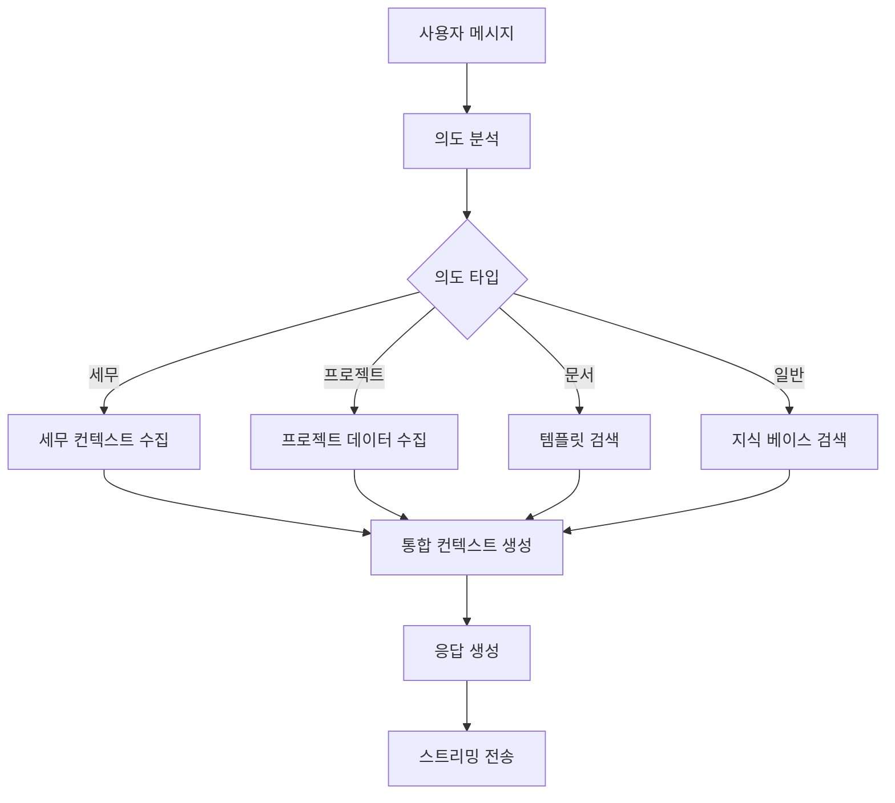

# 🤖 AI 업무비서 통합 아키텍처 설계

## 📋 개요

WEAVE AI 업무비서를 하나의 통합된 지능형 시스템으로 재설계합니다. 
기존의 일반/RAG/세무 모드 구분을 제거하고, 컨텍스트 인식 기반의 스마트 응답 시스템을 구축합니다.

## 🎯 핵심 목표

1. **단일 진입점**: 사용자는 모드 선택 없이 자연스럽게 대화
2. **자동 컨텍스트 인식**: 질문 의도를 자동으로 파악하여 적절한 응답 생성
3. **데이터 통합**: 프로젝트, 클라이언트, 세무 지식을 자동으로 활용
4. **지속적 학습**: 사용자 패턴을 학습하여 개인화된 경험 제공

## 🏗️ 시스템 아키텍처

### 1. 계층 구조

```
┌─────────────────────────────────────────────┐
│            사용자 인터페이스                   │
│         (통합 챗 인터페이스)                   │
└────────────────┬────────────────────────────┘
                 │
┌────────────────▼────────────────────────────┐
│          통합 AI 오케스트레이터                │
│  (Intent Analyzer + Context Manager)        │
└────────────────┬────────────────────────────┘
                 │
    ┌────────────┴────────────┬──────────────┐
    │                         │              │
┌───▼────┐           ┌────────▼────┐  ┌─────▼─────┐
│Knowledge│           │Business Data│  │User Context│
│  Base   │           │   Layer     │  │  Manager   │
│(세무/일반)│           │(프로젝트/클라)│  │(개인화/이력)│
└─────────┘           └─────────────┘  └────────────┘
```

### 2. 핵심 컴포넌트

#### 2.1 통합 AI 오케스트레이터 (Unified AI Orchestrator)

**역할**: 모든 요청의 중앙 처리 허브

```typescript
interface UnifiedAIOrchestrator {
  // 의도 분석
  analyzeIntent(message: string): IntentAnalysis;
  
  // 컨텍스트 수집
  gatherContext(intent: IntentAnalysis, userId: string): EnrichedContext;
  
  // 응답 생성 전략 결정
  determineStrategy(context: EnrichedContext): ResponseStrategy;
  
  // 응답 생성
  generateResponse(strategy: ResponseStrategy): Promise<AIResponse>;
}

interface IntentAnalysis {
  primaryIntent: 'tax' | 'project' | 'document' | 'general' | 'analysis';
  confidence: number;
  entities: Entity[];
  requiredContext: string[];
}
```

#### 2.2 스마트 컨텍스트 매니저 (Smart Context Manager)

**역할**: 필요한 모든 컨텍스트를 자동으로 수집하고 관리

```typescript
interface ContextManager {
  // 사용자 컨텍스트
  getUserContext(userId: string): UserContext;
  
  // 비즈니스 데이터 컨텍스트
  getBusinessContext(userId: string, intent: IntentAnalysis): BusinessContext;
  
  // 지식 베이스 컨텍스트
  getKnowledgeContext(query: string, domain: string): KnowledgeContext;
  
  // 통합 컨텍스트 생성
  buildEnrichedContext(contexts: Partial<AllContexts>): EnrichedContext;
}

interface EnrichedContext {
  user: {
    id: string;
    preferences: UserPreferences;
    history: ChatHistory[];
  };
  business: {
    projects: ProjectSummary[];
    clients: ClientSummary[];
    documents: DocumentSummary[];
    financials: FinancialSummary;
  };
  knowledge: {
    taxRules: TaxKnowledge[];
    bestPractices: BestPractice[];
    templates: Template[];
  };
  relevanceScores: Map<string, number>;
}
```

#### 2.3 의도 분석기 (Intent Analyzer)

**역할**: 자연어 처리를 통한 사용자 의도 파악

```typescript
class IntentAnalyzer {
  private patterns = {
    tax: [
      /세금|세무|소득세|부가세|VAT|원천징수|신고|공제|절세/,
      /종합소득세|사업소득|근로소득|4대보험/
    ],
    project: [
      /프로젝트|일정|마일스톤|진행|상황|납기|계약/,
      /클라이언트|고객|거래처/
    ],
    document: [
      /문서|보고서|견적서|계약서|인보이스|청구서/,
      /작성|생성|만들/
    ],
    analysis: [
      /분석|통계|차트|그래프|리포트|현황/,
      /수익|지출|매출|비용/
    ]
  };
  
  analyze(message: string): IntentAnalysis {
    // 1. 패턴 매칭
    const matchedIntents = this.matchPatterns(message);
    
    // 2. NER (Named Entity Recognition)
    const entities = this.extractEntities(message);
    
    // 3. 컨텍스트 요구사항 분석
    const requiredContext = this.analyzeContextNeeds(matchedIntents, entities);
    
    return {
      primaryIntent: this.selectPrimaryIntent(matchedIntents),
      confidence: this.calculateConfidence(matchedIntents),
      entities,
      requiredContext
    };
  }
}
```

#### 2.4 데이터 통합 레이어 (Data Integration Layer)

**역할**: 다양한 데이터 소스를 통합 관리

```typescript
class DataIntegrationLayer {
  private dataSources = {
    projects: ProjectService,
    clients: ClientService,
    documents: DocumentService,
    taxes: TaxService,
    knowledge: KnowledgeBaseService
  };
  
  async fetchRelevantData(
    intent: IntentAnalysis,
    userId: string
  ): Promise<IntegratedData> {
    const relevantSources = this.identifyRelevantSources(intent);
    
    // 병렬 데이터 페칭
    const dataPromises = relevantSources.map(source => 
      this.dataSources[source].fetch(userId, intent.entities)
    );
    
    const results = await Promise.all(dataPromises);
    
    return this.mergeAndRank(results, intent);
  }
  
  private identifyRelevantSources(intent: IntentAnalysis): string[] {
    const sourceMap = {
      'tax': ['taxes', 'knowledge', 'projects'],
      'project': ['projects', 'clients', 'documents'],
      'document': ['documents', 'projects', 'templates'],
      'analysis': ['projects', 'clients', 'taxes', 'documents'],
      'general': ['knowledge']
    };
    
    return sourceMap[intent.primaryIntent] || ['knowledge'];
  }
}
```

### 3. 통합 API 설계

#### 3.1 단일 엔드포인트

```typescript
// /api/ai-assistant/unified/route.ts

export async function POST(request: NextRequest) {
  const { message, sessionId, userId } = await request.json();
  
  // 1. 의도 분석
  const intentAnalyzer = new IntentAnalyzer();
  const intent = intentAnalyzer.analyze(message);
  
  // 2. 컨텍스트 수집
  const contextManager = new ContextManager();
  const context = await contextManager.buildEnrichedContext({
    userId,
    intent,
    sessionId
  });
  
  // 3. 데이터 통합
  const dataLayer = new DataIntegrationLayer();
  const integratedData = await dataLayer.fetchRelevantData(intent, userId);
  
  // 4. 응답 생성
  const orchestrator = new UnifiedAIOrchestrator();
  const response = await orchestrator.generateResponse({
    intent,
    context,
    data: integratedData
  });
  
  // 5. 스트리밍 응답
  return createStreamingResponse(response);
}
```

### 4. 자동 RAG 시스템

#### 4.1 내장 지식 베이스

```typescript
class EmbeddedKnowledgeBase {
  private knowledgeDomains = {
    tax: TaxKnowledgeBase,      // 세무 지식
    business: BusinessKnowledge, // 비즈니스 모범 사례
    templates: TemplateLibrary,  // 문서 템플릿
    regulations: RegulationDB    // 법규 데이터베이스
  };
  
  async query(
    question: string,
    domain: string,
    context: EnrichedContext
  ): Promise<KnowledgeResult> {
    // 1. 벡터 검색
    const vectorResults = await this.vectorSearch(question, domain);
    
    // 2. 컨텍스트 기반 필터링
    const filtered = this.filterByContext(vectorResults, context);
    
    // 3. 관련성 순위 정렬
    const ranked = this.rankByRelevance(filtered, question);
    
    return {
      chunks: ranked.slice(0, 5),
      confidence: this.calculateConfidence(ranked)
    };
  }
}
```

#### 4.2 동적 컨텍스트 주입

```typescript
class DynamicContextInjector {
  inject(
    basePrompt: string,
    context: EnrichedContext,
    knowledge: KnowledgeResult
  ): string {
    let enrichedPrompt = basePrompt;
    
    // 1. 사용자 프로젝트/클라이언트 정보 주입
    if (context.business.projects.length > 0) {
      enrichedPrompt += `\n\n현재 진행 중인 프로젝트:\n`;
      enrichedPrompt += context.business.projects
        .map(p => `- ${p.name}: ${p.status} (${p.progress}%)`)
        .join('\n');
    }
    
    // 2. 관련 지식 주입
    if (knowledge.chunks.length > 0) {
      enrichedPrompt += `\n\n관련 정보:\n`;
      enrichedPrompt += knowledge.chunks
        .map(k => `- ${k.title}: ${k.content}`)
        .join('\n');
    }
    
    // 3. 개인화 정보 주입
    if (context.user.preferences) {
      enrichedPrompt += `\n\n사용자 선호 설정:\n`;
      enrichedPrompt += `- 응답 스타일: ${context.user.preferences.responseStyle}\n`;
      enrichedPrompt += `- 전문 분야: ${context.user.preferences.expertise.join(', ')}`;
    }
    
    return enrichedPrompt;
  }
}
```

### 5. 실시간 학습 시스템

```typescript
class AdaptiveLearningSystem {
  private userPatterns: Map<string, UserPattern> = new Map();
  
  async learn(
    userId: string,
    interaction: Interaction
  ): Promise<void> {
    // 1. 패턴 추출
    const patterns = this.extractPatterns(interaction);
    
    // 2. 기존 패턴 업데이트
    const existingPatterns = this.userPatterns.get(userId) || new UserPattern();
    existingPatterns.update(patterns);
    
    // 3. 선호도 학습
    this.updatePreferences(userId, interaction);
    
    // 4. 자주 사용하는 기능 추적
    this.trackFrequentFeatures(userId, interaction);
  }
  
  getPersonalization(userId: string): PersonalizationProfile {
    const patterns = this.userPatterns.get(userId);
    
    return {
      preferredResponseLength: patterns?.avgResponseLength || 'medium',
      frequentTopics: patterns?.topTopics || [],
      preferredExamples: patterns?.likesExamples || false,
      commonQuestionTypes: patterns?.questionTypes || [],
      workingHours: patterns?.activeHours || [],
      projectFocus: patterns?.focusedProjects || []
    };
  }
}
```

## 🔄 데이터 플로우

### 1. 요청 처리 플로우



### 2. 컨텍스트 우선순위

1. **즉시 컨텍스트**: 현재 대화, 직전 메시지
2. **세션 컨텍스트**: 현재 세션의 대화 이력
3. **사용자 컨텍스트**: 프로젝트, 클라이언트, 선호도
4. **도메인 컨텍스트**: 세무 지식, 비즈니스 규칙
5. **일반 컨텍스트**: 공통 지식, 모범 사례

## 🚀 구현 계획

### Phase 1: 기초 통합 (1주)
- [ ] 통합 API 엔드포인트 생성
- [ ] 의도 분석기 구현
- [ ] 기존 3개 API 통합

### Phase 2: 컨텍스트 시스템 (1주)
- [ ] 스마트 컨텍스트 매니저 구현
- [ ] 데이터 통합 레이어 구축
- [ ] 자동 RAG 시스템 구현

### Phase 3: 지능화 (1주)
- [ ] 동적 컨텍스트 주입 구현
- [ ] 실시간 학습 시스템 구축
- [ ] 개인화 프로필 관리

### Phase 4: 최적화 (1주)
- [ ] 성능 최적화
- [ ] 캐싱 전략 구현
- [ ] A/B 테스팅 시스템

## 📊 기대 효과

1. **사용성 향상**: 모드 선택 없이 자연스러운 대화
2. **정확도 증가**: 컨텍스트 기반 정확한 응답
3. **개인화 강화**: 사용자별 맞춤형 경험
4. **효율성 증대**: 자동 데이터 활용으로 빠른 업무 처리
5. **확장성 확보**: 새로운 도메인 쉽게 추가 가능

## 🔒 보안 고려사항

1. **데이터 격리**: 사용자별 데이터 완전 분리
2. **권한 관리**: 역할 기반 접근 제어 (RBAC)
3. **암호화**: 민감 데이터 암호화 저장
4. **감사 로그**: 모든 AI 상호작용 기록
5. **프라이버시**: GDPR/개인정보보호법 준수

## 📈 성능 목표

- **응답 시간**: < 2초 (첫 번째 토큰)
- **정확도**: > 90% (의도 분석)
- **관련성**: > 85% (컨텍스트 매칭)
- **가용성**: 99.9% 업타임
- **동시 사용자**: 1000+ 지원

## 🔮 향후 확장 계획

1. **멀티모달 지원**: 이미지, PDF 직접 분석
2. **예측 분석**: 사용자 니즈 선제적 예측
3. **자동화 트리거**: AI 기반 업무 자동화
4. **외부 통합**: 타사 서비스 연동
5. **음성 인터페이스**: 음성 명령 지원