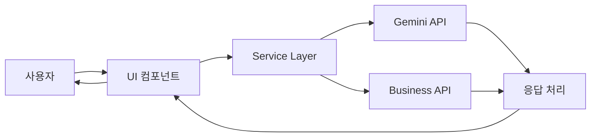

# AI Assistant 시스템 아키텍처 설계서

## 개요
AI Assistant 기능을 weave-dev 프로젝트의 검증된 컴포넌트들을 활용하여 현재 프로젝트에 통합하는 시스템 설계서입니다.

## 시스템 아키텍처

### 1. 레이어드 아키텍처

```
┌─────────────────────────────────────────────────┐
│               Presentation Layer                 │
│         (Next.js App Router Pages)              │
├─────────────────────────────────────────────────┤
│              Component Layer                     │
│       (재사용 가능한 UI 컴포넌트)               │
├─────────────────────────────────────────────────┤
│               Service Layer                      │
│         (비즈니스 로직 및 AI 통합)              │
├─────────────────────────────────────────────────┤
│                 Data Layer                       │
│          (API 통신 및 데이터 관리)              │
└─────────────────────────────────────────────────┘
```

### 2. 컴포넌트 통합 전략

#### 2.1 weave-dev 컴포넌트 이식 계획

**Phase 1: Core Components (우선순위: 높음)**
- `DataExtractor` - 데이터 추출 컴포넌트
- `DocumentGenerator` - 문서 생성 컴포넌트
- `DocumentEditor` - 마크다운 에디터

**Phase 2: Business Components (우선순위: 중간)**
- `BusinessInfoLookup` - 사업자 정보 조회
- `FileUploadDropzone` - 파일 업로드

**Phase 3: Advanced Components (우선순위: 낮음)**
- `DocumentRequestSystem` - 이메일 시스템
- `WeaveAssistant` - 통합 컴포넌트

#### 2.2 디렉토리 구조

```
src/
├── app/ai-assistant/
│   ├── page.tsx                     # 메인 페이지 (통합 대시보드)
│   ├── extract/page.tsx             # 데이터 추출 페이지
│   ├── generate/page.tsx            # 문서 생성 페이지
│   ├── business-lookup/page.tsx     # 사업자 조회 페이지
│   └── layout.tsx                   # 공통 레이아웃
│
├── components/
│   ├── ai-assistant/                # AI 관련 컴포넌트
│   │   ├── DataExtractor/
│   │   │   ├── index.tsx
│   │   │   ├── types.ts
│   │   │   └── utils.ts
│   │   ├── DocumentGenerator/
│   │   │   ├── index.tsx
│   │   │   ├── templates/
│   │   │   └── types.ts
│   │   └── DocumentEditor/
│   │       └── index.tsx
│   │
│   ├── shared/                      # 공통 컴포넌트
│   │   ├── FileUpload/
│   │   ├── PreviewModal/
│   │   └── TabNavigation/
│   │
│   └── ui/                          # 기존 UI 컴포넌트 활용
│
├── services/
│   ├── ai/
│   │   ├── gemini.service.ts       # Gemini API 통합
│   │   └── types.ts
│   ├── business/
│   │   └── lookup.service.ts       # 사업자 정보 API
│   └── document/
│       └── generator.service.ts     # 문서 생성 서비스
│
└── lib/
    ├── utils/
    └── constants/
```

### 3. 데이터 플로우 설계



### 4. 주요 기능 구현 설계

#### 4.1 데이터 추출 (DataExtractor)

**기능 요구사항:**
- 이미지/PDF 파일 업로드
- 드래그앤드롭 지원
- Gemini Flash Lite 활용
- JSON 형식 데이터 추출
- 클립보드 복사 기능

**구현 계획:**
```typescript
interface DataExtractorProps {
  onDataExtracted: (data: ExtractedData) => void;
  acceptedFileTypes?: string[];
  maxFileSize?: number;
}

interface ExtractedData {
  type: 'receipt' | 'invoice' | 'contract' | 'unknown';
  fields: Record<string, any>;
  confidence: number;
  rawText: string;
}
```

#### 4.2 문서 생성 (DocumentGenerator)

**기능 요구사항:**
- 다양한 템플릿 제공
- 마크다운 에디터
- HTML 미리보기
- PDF/Word 다운로드

**템플릿 구조:**
```typescript
interface DocumentTemplate {
  id: string;
  name: string;
  category: 'quote' | 'contract' | 'proposal' | 'invoice';
  fields: TemplateField[];
  markdown: string;
}

interface TemplateField {
  key: string;
  label: string;
  type: 'text' | 'number' | 'date' | 'select' | 'textarea';
  required: boolean;
  validation?: ValidationRule;
}
```

#### 4.3 사업자 정보 조회 (BusinessInfoLookup)

**기능 요구사항:**
- 사업자등록번호 검증
- 실시간 API 조회
- 상세 정보 표시

**API 통합:**
```typescript
interface BusinessInfo {
  businessNumber: string;
  companyName: string;
  ceoName: string;
  businessType: string;
  businessItem: string;
  address: string;
  taxInvoiceEmail?: string;
  status: 'active' | 'closed' | 'suspended';
}
```

### 5. 상태 관리 전략

#### 5.1 컴포넌트 상태
- 각 컴포넌트는 독립적인 상태 관리
- React hooks (useState, useReducer) 활용
- 필요시 Context API 적용

#### 5.2 전역 상태 (필요시)
```typescript
interface AIAssistantContext {
  user: UserInfo;
  settings: UserSettings;
  cache: DataCache;
}
```

### 6. API 설계

#### 6.1 RESTful API 엔드포인트

```
POST   /api/ai-assistant/extract      # 데이터 추출
POST   /api/ai-assistant/generate     # 문서 생성
GET    /api/business-info/:number     # 사업자 정보 조회
POST   /api/documents/save            # 문서 저장
GET    /api/templates                 # 템플릿 목록
```

#### 6.2 API 응답 구조

```typescript
interface APIResponse<T> {
  success: boolean;
  data?: T;
  error?: {
    code: string;
    message: string;
  };
  metadata?: {
    timestamp: string;
    version: string;
  };
}
```

### 7. 보안 고려사항

1. **파일 업로드 검증**
   - 파일 크기 제한 (10MB)
   - 파일 타입 검증
   - 바이러스 스캔

2. **API 보안**
   - Rate limiting
   - API key 관리
   - CORS 설정

3. **데이터 보호**
   - 민감정보 마스킹
   - 임시 파일 자동 삭제
   - 암호화된 전송

### 8. 성능 최적화

1. **컴포넌트 최적화**
   - Code splitting
   - Lazy loading
   - Memoization

2. **API 최적화**
   - Response caching
   - Debouncing/Throttling
   - Parallel requests

3. **파일 처리**
   - 청크 업로드
   - 프로그레시브 렌더링
   - 웹 워커 활용

### 9. 테스트 전략

1. **단위 테스트**
   - 컴포넌트 테스트
   - 서비스 테스트
   - 유틸리티 테스트

2. **통합 테스트**
   - API 통합 테스트
   - 컴포넌트 통합 테스트

3. **E2E 테스트**
   - 주요 사용자 시나리오
   - 크로스 브라우저 테스트

### 10. 배포 계획

**Phase 1: MVP (1주차)**
- DataExtractor 기본 기능
- DocumentGenerator 기본 템플릿
- 기본 UI/UX

**Phase 2: Enhancement (2주차)**
- BusinessInfoLookup 통합
- 추가 템플릿
- 성능 최적화

**Phase 3: Production (3주차)**
- 전체 기능 통합
- 테스트 완료
- 문서화 완성

## 기술 스택

- **Frontend**: Next.js 14 (App Router), TypeScript, Tailwind CSS
- **AI Integration**: Google Gemini API (Flash Lite)
- **State Management**: React Hooks, Context API
- **Testing**: Jest, React Testing Library
- **Build Tool**: Turbopack
- **Deployment**: Vercel

## 환경 변수

```env
# AI Services
NEXT_PUBLIC_GEMINI_API_KEY=
GEMINI_MODEL=gemini-2.0-flash-exp

# Business API
BUSINESS_API_KEY=
BUSINESS_API_URL=

# App Config
NEXT_PUBLIC_APP_URL=http://localhost:3000
NODE_ENV=development
```

## 참고 자료

- weave-dev 컴포넌트 가이드
- Gemini API 문서
- Next.js 14 공식 문서
- CLAUDE.md 프로젝트 규칙