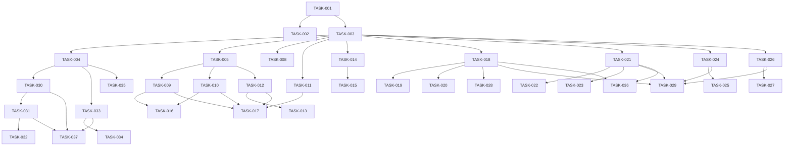

# 📋 세무 관리 시스템 개편 Task 목록

## 📊 Task 관리 대시보드

| Phase | 총 Tasks | 완료 | 진행중 | 대기 | 진행률 |
|-------|---------|------|--------|------|--------|
| Phase 1 | 8 | 8 | 0 | 0 | 100% |
| Phase 2 | 9 | 0 | 0 | 9 | 0% |
| Phase 3 | 12 | 0 | 0 | 12 | 0% |
| Phase 4 | 8 | 0 | 0 | 8 | 0% |
| Phase 5 | 10 | 0 | 0 | 10 | 0% |
| Phase 6 | 8 | 0 | 0 | 8 | 0% |
| **Total** | **55** | **8** | **0** | **47** | **14.5%** |

---

## Phase 1: 기본 구조 구현 (Week 1)

### 데이터베이스 설정

- [x] **TASK-001** | 데이터베이스 마이그레이션 실행
  - **Description**: 006_tax_management_redesign.sql 마이그레이션 실행 및 검증
  - **Status**: `completed`
  - **Dependencies**: None
  - **Priority**: `critical`
  - **Details**: tax_transactions, tax_monthly_summary 테이블 생성, RLS 정책 적용, 트리거 함수 설정
  - **Test Strategy**: 
    - 테이블 생성 확인 (DESCRIBE 명령)
    - RLS 정책 동작 검증 (다중 사용자 시나리오)
    - 트리거 함수 실행 테스트 (샘플 데이터 입력)

- [x] **TASK-002** | 샘플 데이터 삽입
  - **Description**: 개발/테스트용 샘플 거래 데이터 생성
  - **Status**: `completed`
  - **Dependencies**: TASK-001
  - **Priority**: `medium`
  - **Details**: 2025년 1-3월 매입/매출 데이터 100건 생성, 다양한 거래 유형 포함
  - **Test Strategy**: 
    - 데이터 무결성 검증
    - 집계 테이블 자동 업데이트 확인

### API 서비스 레이어

- [x] **TASK-003** | TaxTransactionService 클래스 구현
  - **Description**: tax-transactions.service.ts 파일 생성 및 기본 CRUD 메서드 구현
  - **Status**: `completed`
  - **Dependencies**: TASK-001
  - **Priority**: `critical`
  - **Details**: createTransaction, getTransactions, updateTransaction, deleteTransaction 메서드
  - **Test Strategy**: 
    - 단위 테스트 작성 (Jest)
    - 모든 CRUD 작업 검증
    - 에러 핸들링 테스트

- [x] **TASK-004** | 프로젝트 연동 API 구현
  - **Description**: linkToProject, getProjectTransactions 메서드 구현
  - **Status**: `completed`
  - **Dependencies**: TASK-003
  - **Priority**: `high`
  - **Details**: 거래와 프로젝트 연결, 프로젝트별 거래 조회
  - **Test Strategy**: 
    - 프로젝트 연동 시나리오 테스트
    - NULL 처리 검증

- [x] **TASK-005** | 통계 및 집계 API 구현
  - **Description**: getMonthlyStatistics, getYearlyProjection 메서드 구현
  - **Status**: `completed`
  - **Dependencies**: TASK-003
  - **Priority**: `high`
  - **Details**: 월별 통계 계산, 연간 매출 예상 로직
  - **Test Strategy**: 
    - 계산 정확도 검증
    - 성능 테스트 (대량 데이터)

### UI 구조 변경

- [x] **TASK-006** | 메인 페이지 탭 구조 변경
  - **Description**: tax-management/page.tsx 수정 - 3개 탭으로 변경
  - **Status**: `completed`
  - **Dependencies**: None
  - **Priority**: `high`
  - **Details**: 개요/매입매출 상세/세무 신고 탭 구현
  - **Test Strategy**: 
    - 탭 전환 기능 테스트
    - 라우팅 검증

- [x] **TASK-007** | 컴포넌트 폴더 구조 생성
  - **Description**: src/components/tax/ 하위 폴더 및 파일 구조 생성
  - **Status**: `completed`
  - **Dependencies**: None
  - **Priority**: `medium`
  - **Details**: TaxOverview, TaxTransactions, TaxFiling 컴포넌트 파일 생성
  - **Test Strategy**: 
    - 컴포넌트 렌더링 테스트
    - Props 타입 검증

- [x] **TASK-008** | Zustand 스토어 설정
  - **Description**: taxStore.ts 생성 및 상태 관리 구조 설정
  - **Status**: `completed`
  - **Dependencies**: TASK-003
  - **Priority**: `medium`
  - **Details**: 거래 상태, 필터, 통계 데이터 관리
  - **Test Strategy**: 
    - 상태 업데이트 검증
    - 액션 테스트

---

## Phase 2: 개요 탭 구현 (Week 1-2)

### 매출 예상 카드

- [ ] **TASK-009** | 연간 매출 예상 카드 컴포넌트
  - **Description**: YearlyProjectionCard 컴포넌트 구현
  - **Status**: `pending`
  - **Dependencies**: TASK-005
  - **Priority**: `high`
  - **Details**: 연간 매출 예상액, 전년 대비 성장률 표시
  - **Test Strategy**: 
    - 데이터 바인딩 검증
    - 숫자 포맷팅 테스트

- [ ] **TASK-010** | 당월 매출 카드 컴포넌트
  - **Description**: MonthlyRevenueCard 컴포넌트 구현
  - **Status**: `pending`
  - **Dependencies**: TASK-005
  - **Priority**: `high`
  - **Details**: 현재 월 매출, 전월 대비 비율 표시
  - **Test Strategy**: 
    - 월 전환 시나리오 테스트
    - 비율 계산 검증

- [ ] **TASK-011** | 다음 신고 일정 카드
  - **Description**: TaxDeadlineCard 컴포넌트 구현
  - **Status**: `pending`
  - **Dependencies**: TASK-003
  - **Priority**: `medium`
  - **Details**: 부가세 신고 마감일, D-Day 카운트다운
  - **Test Strategy**: 
    - 날짜 계산 정확도
    - 타임존 처리 검증

### 차트 컴포넌트

- [ ] **TASK-012** | 월별 트렌드 차트 구현
  - **Description**: MonthlyTrendChart 컴포넌트 - Recharts 활용
  - **Status**: `pending`
  - **Dependencies**: TASK-005
  - **Priority**: `high`
  - **Details**: 라인 차트, 매출/매입 비교, 반응형 디자인
  - **Test Strategy**: 
    - 데이터 시각화 검증
    - 반응형 레이아웃 테스트

- [ ] **TASK-013** | 차트 데이터 포맷터
  - **Description**: 차트 데이터 변환 유틸리티 함수
  - **Status**: `pending`
  - **Dependencies**: TASK-012
  - **Priority**: `medium`
  - **Details**: 금액 포맷팅, 축 라벨 생성, 툴팁 데이터
  - **Test Strategy**: 
    - 포맷 함수 단위 테스트
    - 엣지 케이스 처리

### 실시간 업데이트

- [ ] **TASK-014** | Supabase 실시간 구독 설정
  - **Description**: 거래 변경사항 실시간 반영
  - **Status**: `pending`
  - **Dependencies**: TASK-003
  - **Priority**: `medium`
  - **Details**: PostgreSQL Changes 구독, 상태 자동 업데이트
  - **Test Strategy**: 
    - 실시간 동기화 테스트
    - 연결 복구 시나리오

- [ ] **TASK-015** | 통계 자동 갱신 로직
  - **Description**: 거래 추가/수정 시 통계 자동 재계산
  - **Status**: `pending`
  - **Dependencies**: TASK-014
  - **Priority**: `medium`
  - **Details**: 디바운싱 적용, 최적화된 재계산
  - **Test Strategy**: 
    - 성능 프로파일링
    - 동시성 테스트

- [ ] **TASK-016** | 로딩 및 에러 상태 처리
  - **Description**: 스켈레톤 로더, 에러 바운더리 구현
  - **Status**: `pending`
  - **Dependencies**: TASK-009, TASK-010
  - **Priority**: `low`
  - **Details**: 로딩 스켈레톤, 에러 메시지, 재시도 로직
  - **Test Strategy**: 
    - 에러 시나리오 테스트
    - UX 검증

- [ ] **TASK-017** | 개요 탭 통합 테스트
  - **Description**: TaxOverview 컴포넌트 전체 통합 테스트
  - **Status**: `pending`
  - **Dependencies**: TASK-009, TASK-010, TASK-011, TASK-012
  - **Priority**: `high`
  - **Details**: 모든 서브 컴포넌트 통합, 데이터 플로우 검증
  - **Test Strategy**: 
    - E2E 테스트 시나리오
    - 스냅샷 테스트

---

## Phase 3: 매입매출 상세 구현 (Week 2-3)

### 데이터 테이블

- [ ] **TASK-018** | 데스크톱 테이블 컴포넌트
  - **Description**: TransactionTable 컴포넌트 - 엑셀형 테이블
  - **Status**: `pending`
  - **Dependencies**: TASK-003
  - **Priority**: `critical`
  - **Details**: 정렬, 필터링, 인라인 편집, 다중 선택
  - **Test Strategy**: 
    - 테이블 인터랙션 테스트
    - 대량 데이터 렌더링 성능

- [ ] **TASK-019** | 가상 스크롤링 구현
  - **Description**: react-window 활용한 가상 스크롤
  - **Status**: `pending`
  - **Dependencies**: TASK-018
  - **Priority**: `high`
  - **Details**: 1000+ 행 성능 최적화, 동적 행 높이
  - **Test Strategy**: 
    - 스크롤 성능 측정
    - 메모리 사용량 모니터링

- [ ] **TASK-020** | 인라인 편집 기능
  - **Description**: 셀 직접 편집, 자동 저장
  - **Status**: `pending`
  - **Dependencies**: TASK-018
  - **Priority**: `high`
  - **Details**: 더블클릭 편집, ESC 취소, Enter 저장
  - **Test Strategy**: 
    - 편집 워크플로우 테스트
    - 데이터 유효성 검증

### 모바일 뷰

- [ ] **TASK-021** | 모바일 카드 컴포넌트
  - **Description**: TransactionCards 컴포넌트 - 카드형 리스트
  - **Status**: `pending`
  - **Dependencies**: TASK-003
  - **Priority**: `high`
  - **Details**: 스와이프 제스처, 터치 최적화
  - **Test Strategy**: 
    - 터치 인터랙션 테스트
    - 반응형 브레이크포인트

- [ ] **TASK-022** | 스와이프 액션 구현
  - **Description**: 좌우 스와이프로 편집/삭제
  - **Status**: `pending`
  - **Dependencies**: TASK-021
  - **Priority**: `medium`
  - **Details**: 제스처 인식, 애니메이션, 햅틱 피드백
  - **Test Strategy**: 
    - 제스처 정확도 테스트
    - 애니메이션 성능

- [ ] **TASK-023** | 무한 스크롤 페이지네이션
  - **Description**: 스크롤 기반 자동 로딩
  - **Status**: `pending`
  - **Dependencies**: TASK-021
  - **Priority**: `medium`
  - **Details**: Intersection Observer, 로딩 인디케이터
  - **Test Strategy**: 
    - 페이지네이션 로직 검증
    - 네트워크 요청 최적화

### 필터링 시스템

- [ ] **TASK-024** | 필터 컴포넌트 구현
  - **Description**: TransactionFilter 컴포넌트
  - **Status**: `pending`
  - **Dependencies**: TASK-003
  - **Priority**: `high`
  - **Details**: 날짜 범위, 거래 유형, 프로젝트, 클라이언트 필터
  - **Test Strategy**: 
    - 필터 조합 테스트
    - URL 쿼리 파라미터 동기화

- [ ] **TASK-025** | 검색 기능 구현
  - **Description**: 실시간 검색, 자동완성
  - **Status**: `pending`
  - **Dependencies**: TASK-024
  - **Priority**: `medium`
  - **Details**: 공급자명, 금액, 설명 검색, 디바운싱
  - **Test Strategy**: 
    - 검색 정확도 검증
    - 성능 최적화 측정

### 상세 모달

- [ ] **TASK-026** | 거래 상세 모달
  - **Description**: TransactionDetailModal 컴포넌트
  - **Status**: `pending`
  - **Dependencies**: TASK-003
  - **Priority**: `medium`
  - **Details**: 전체 정보 표시, 편집 폼, 증빙 자료 업로드
  - **Test Strategy**: 
    - 모달 상태 관리 테스트
    - 폼 유효성 검증

- [ ] **TASK-027** | 거래 추가 모달
  - **Description**: AddTransactionModal 컴포넌트
  - **Status**: `pending`
  - **Dependencies**: TASK-026
  - **Priority**: `high`
  - **Details**: 새 거래 입력 폼, 자동 계산, 유효성 검사
  - **Test Strategy**: 
    - 폼 제출 워크플로우
    - 계산 정확도 검증

- [ ] **TASK-028** | 일괄 편집 기능
  - **Description**: 다중 선택 후 일괄 수정
  - **Status**: `pending`
  - **Dependencies**: TASK-018
  - **Priority**: `low`
  - **Details**: 체크박스 선택, 일괄 상태 변경, 일괄 삭제
  - **Test Strategy**: 
    - 다중 선택 로직 테스트
    - 트랜잭션 처리 검증

- [ ] **TASK-029** | 매입매출 탭 통합 테스트
  - **Description**: TaxTransactions 컴포넌트 전체 테스트
  - **Status**: `pending`
  - **Dependencies**: TASK-018, TASK-021, TASK-024, TASK-026
  - **Priority**: `high`
  - **Details**: 데스크톱/모바일 뷰 전환, 필터링, CRUD 작업
  - **Test Strategy**: 
    - 크로스 브라우저 테스트
    - 반응형 디자인 검증

---

## Phase 4: 프로젝트 연동 (Week 3-4)

### 자동 매칭

- [ ] **TASK-030** | 클라이언트 기반 자동 매칭
  - **Description**: 거래 입력 시 클라이언트 자동 감지
  - **Status**: `pending`
  - **Dependencies**: TASK-004
  - **Priority**: `high`
  - **Details**: 사업자번호/상호명 매칭, 유사도 알고리즘
  - **Test Strategy**: 
    - 매칭 정확도 측정
    - 엣지 케이스 처리

- [ ] **TASK-031** | 프로젝트 자동 연결
  - **Description**: 진행 중인 프로젝트와 자동 매칭
  - **Status**: `pending`
  - **Dependencies**: TASK-030
  - **Priority**: `high`
  - **Details**: 날짜/금액 기반 매칭, 신뢰도 점수
  - **Test Strategy**: 
    - 매칭 알고리즘 검증
    - 오탐/미탐 비율 측정

- [ ] **TASK-032** | 매칭 확인 UI
  - **Description**: 자동 매칭 결과 확인/수정 인터페이스
  - **Status**: `pending`
  - **Dependencies**: TASK-031
  - **Priority**: `medium`
  - **Details**: 매칭 제안 표시, 수동 연결, 연결 해제
  - **Test Strategy**: 
    - 사용자 워크플로우 테스트
    - UX 피드백 수집

### 수익성 분석

- [ ] **TASK-033** | 프로젝트별 수익 계산
  - **Description**: 프로젝트 단위 매출/매입 집계
  - **Status**: `pending`
  - **Dependencies**: TASK-004
  - **Priority**: `high`
  - **Details**: 순이익 계산, 마진율, ROI
  - **Test Strategy**: 
    - 계산 로직 검증
    - 집계 정확도 테스트

- [ ] **TASK-034** | 수익성 대시보드
  - **Description**: ProjectProfitabilityDashboard 컴포넌트
  - **Status**: `pending`
  - **Dependencies**: TASK-033
  - **Priority**: `medium`
  - **Details**: 프로젝트별 수익 차트, 비교 분석
  - **Test Strategy**: 
    - 데이터 시각화 검증
    - 인터랙티브 기능 테스트

- [ ] **TASK-035** | 프로젝트 거래 내역 뷰
  - **Description**: 프로젝트별 거래 필터링 뷰
  - **Status**: `pending`
  - **Dependencies**: TASK-004
  - **Priority**: `medium`
  - **Details**: 프로젝트 선택 시 관련 거래만 표시
  - **Test Strategy**: 
    - 필터링 정확도
    - 성능 최적화

- [ ] **TASK-036** | 연동 상태 표시
  - **Description**: 거래별 프로젝트 연동 상태 인디케이터
  - **Status**: `pending`
  - **Dependencies**: TASK-018, TASK-021
  - **Priority**: `low`
  - **Details**: 연동 아이콘, 프로젝트명 표시, 퀵 링크
  - **Test Strategy**: 
    - UI 일관성 검증
    - 링크 동작 테스트

- [ ] **TASK-037** | 프로젝트 연동 통합 테스트
  - **Description**: 전체 연동 시스템 테스트
  - **Status**: `pending`
  - **Dependencies**: TASK-030, TASK-031, TASK-033
  - **Priority**: `high`
  - **Details**: 자동 매칭, 수동 연결, 수익성 계산
  - **Test Strategy**: 
    - 시나리오 기반 테스트
    - 데이터 일관성 검증

---

## Phase 5: 고급 기능 (Week 4-5)

### 엑셀 연동

- [ ] **TASK-038** | 엑셀 파일 업로드
  - **Description**: 대량 거래 데이터 임포트
  - **Status**: `pending`
  - **Dependencies**: TASK-003
  - **Priority**: `high`
  - **Details**: XLSX 파싱, 컬럼 매핑, 유효성 검사
  - **Test Strategy**: 
    - 다양한 엑셀 형식 테스트
    - 대용량 파일 처리

- [ ] **TASK-039** | 데이터 매핑 UI
  - **Description**: 엑셀 컬럼과 DB 필드 매핑 인터페이스
  - **Status**: `pending`
  - **Dependencies**: TASK-038
  - **Priority**: `medium`
  - **Details**: 드래그앤드롭 매핑, 자동 감지, 프리셋 저장
  - **Test Strategy**: 
    - 매핑 정확도 검증
    - 사용성 테스트

- [ ] **TASK-040** | 엑셀 익스포트
  - **Description**: 거래 데이터 엑셀 다운로드
  - **Status**: `pending`
  - **Dependencies**: TASK-003
  - **Priority**: `medium`
  - **Details**: 필터 적용 내보내기, 템플릿 선택, 포맷 옵션
  - **Test Strategy**: 
    - 생성 파일 검증
    - 다운로드 성능

- [ ] **TASK-041** | 임포트 검증 및 프리뷰
  - **Description**: 임포트 전 데이터 검증 및 미리보기
  - **Status**: `pending`
  - **Dependencies**: TASK-038
  - **Priority**: `medium`
  - **Details**: 오류 표시, 중복 검사, 수정 옵션
  - **Test Strategy**: 
    - 유효성 검사 로직
    - 에러 처리 시나리오

### 보고서 생성

- [ ] **TASK-042** | 월별 세무 보고서
  - **Description**: 월별 매입매출 요약 보고서
  - **Status**: `pending`
  - **Dependencies**: TASK-005
  - **Priority**: `medium`
  - **Details**: PDF 생성, 차트 포함, 이메일 발송
  - **Test Strategy**: 
    - PDF 생성 검증
    - 레이아웃 테스트

- [ ] **TASK-043** | 분기별 부가세 신고서
  - **Description**: 부가세 신고용 보고서 생성
  - **Status**: `pending`
  - **Dependencies**: TASK-042
  - **Priority**: `high`
  - **Details**: 국세청 양식, 자동 계산, 검증
  - **Test Strategy**: 
    - 양식 준수 검증
    - 계산 정확도

### 알림 시스템

- [ ] **TASK-044** | 세무 신고 알림
  - **Description**: 신고 마감일 알림 시스템
  - **Status**: `pending`
  - **Dependencies**: None
  - **Priority**: `medium`
  - **Details**: 이메일/푸시 알림, 리마인더 설정
  - **Test Strategy**: 
    - 알림 발송 테스트
    - 스케줄링 검증

- [ ] **TASK-045** | 이상 거래 감지
  - **Description**: 비정상 패턴 자동 감지
  - **Status**: `pending`
  - **Dependencies**: TASK-003
  - **Priority**: `low`
  - **Details**: 금액 이상치, 중복 거래, 누락 의심
  - **Test Strategy**: 
    - 감지 알고리즘 검증
    - 오탐률 측정

- [ ] **TASK-046** | 대시보드 위젯
  - **Description**: 메인 대시보드용 세무 위젯
  - **Status**: `pending`
  - **Dependencies**: TASK-005
  - **Priority**: `low`
  - **Details**: 간략 통계, 퀵 액션, 알림 표시
  - **Test Strategy**: 
    - 위젯 렌더링 테스트
    - 데이터 동기화

- [ ] **TASK-047** | 고급 기능 통합 테스트
  - **Description**: Phase 5 전체 기능 테스트
  - **Status**: `pending`
  - **Dependencies**: TASK-038, TASK-042, TASK-044
  - **Priority**: `high`
  - **Details**: 엑셀 연동, 보고서, 알림 통합
  - **Test Strategy**: 
    - 워크플로우 테스트
    - 시스템 통합 검증

---

## Phase 6: 최적화 및 테스트 (Week 5-6)

### 성능 최적화

- [ ] **TASK-048** | 쿼리 최적화
  - **Description**: 데이터베이스 쿼리 성능 개선
  - **Status**: `pending`
  - **Dependencies**: All API tasks
  - **Priority**: `high`
  - **Details**: 인덱스 최적화, 쿼리 플랜 분석, N+1 문제 해결
  - **Test Strategy**: 
    - 쿼리 실행 시간 측정
    - EXPLAIN ANALYZE 검증

- [ ] **TASK-049** | 프론트엔드 번들 최적화
  - **Description**: 코드 스플리팅, 트리 쉐이킹
  - **Status**: `pending`
  - **Dependencies**: All UI tasks
  - **Priority**: `medium`
  - **Details**: 동적 임포트, 번들 분석, 압축
  - **Test Strategy**: 
    - 번들 크기 측정
    - 로딩 시간 벤치마크

- [ ] **TASK-050** | 캐싱 전략 구현
  - **Description**: 클라이언트/서버 캐싱
  - **Status**: `pending`
  - **Dependencies**: TASK-048
  - **Priority**: `medium`
  - **Details**: React Query 캐싱, CDN 설정, 브라우저 캐시
  - **Test Strategy**: 
    - 캐시 히트율 측정
    - 무효화 시나리오

### 테스트

- [ ] **TASK-051** | E2E 테스트 스위트
  - **Description**: Playwright E2E 테스트 작성
  - **Status**: `pending`
  - **Dependencies**: All features
  - **Priority**: `critical`
  - **Details**: 주요 사용자 시나리오, 크로스 브라우저
  - **Test Strategy**: 
    - 시나리오 커버리지 90%+
    - CI/CD 통합

- [ ] **TASK-052** | 통합 테스트
  - **Description**: API 통합 테스트
  - **Status**: `pending`
  - **Dependencies**: All API tasks
  - **Priority**: `high`
  - **Details**: 서비스 레이어, 데이터베이스 트랜잭션
  - **Test Strategy**: 
    - 테스트 커버리지 80%+
    - 모킹 전략

- [ ] **TASK-053** | 접근성 테스트
  - **Description**: WCAG 2.1 AA 준수 검증
  - **Status**: `pending`
  - **Dependencies**: All UI tasks
  - **Priority**: `medium`
  - **Details**: 스크린 리더, 키보드 네비게이션, 색상 대비
  - **Test Strategy**: 
    - axe-core 자동 테스트
    - 수동 검증 체크리스트

- [ ] **TASK-054** | 보안 감사
  - **Description**: 보안 취약점 스캔
  - **Status**: `pending`
  - **Dependencies**: All features
  - **Priority**: `high`
  - **Details**: SQL 인젝션, XSS, CSRF, 권한 검증
  - **Test Strategy**: 
    - OWASP Top 10 체크
    - 펜테스트 시나리오

- [ ] **TASK-055** | 최종 검증 및 배포 준비
  - **Description**: 프로덕션 배포 체크리스트
  - **Status**: `pending`
  - **Dependencies**: TASK-048 to TASK-054
  - **Priority**: `critical`
  - **Details**: 환경 설정, 모니터링 설정, 롤백 계획
  - **Test Strategy**: 
    - 스테이징 환경 검증
    - 부하 테스트
    - 롤백 시뮬레이션

---

## 📊 의존성 다이어그램



---

## 🎯 우선순위 매트릭스

| Priority | Tasks | 설명 |
|----------|-------|------|
| **Critical** (P0) | TASK-001, TASK-003, TASK-018, TASK-051, TASK-055 | 시스템 핵심 기능, 즉시 필요 |
| **High** (P1) | TASK-004, TASK-005, TASK-006, TASK-009, TASK-010, TASK-012, TASK-017, TASK-019, TASK-020, TASK-021, TASK-024, TASK-027, TASK-029, TASK-030, TASK-031, TASK-033, TASK-037, TASK-038, TASK-043, TASK-047, TASK-048, TASK-052, TASK-054 | 주요 기능, 1주 내 완료 필요 |
| **Medium** (P2) | TASK-002, TASK-007, TASK-008, TASK-011, TASK-013, TASK-014, TASK-015, TASK-022, TASK-023, TASK-025, TASK-026, TASK-032, TASK-034, TASK-035, TASK-039, TASK-040, TASK-041, TASK-042, TASK-044, TASK-049, TASK-050, TASK-053 | 보조 기능, 2주 내 완료 |
| **Low** (P3) | TASK-016, TASK-028, TASK-036, TASK-045, TASK-046 | 선택적 기능, 여유시 구현 |

---

## 📈 진행 상황 추적

### 주차별 목표

| Week | Phase | 목표 Tasks | 완료 기준 |
|------|-------|-----------|----------|
| Week 1 | Phase 1 | TASK-001 ~ TASK-008 | 기본 구조 완성 |
| Week 1-2 | Phase 2 | TASK-009 ~ TASK-017 | 개요 탭 동작 |
| Week 2-3 | Phase 3 | TASK-018 ~ TASK-029 | 거래 관리 완성 |
| Week 3-4 | Phase 4 | TASK-030 ~ TASK-037 | 프로젝트 연동 |
| Week 4-5 | Phase 5 | TASK-038 ~ TASK-047 | 고급 기능 구현 |
| Week 5-6 | Phase 6 | TASK-048 ~ TASK-055 | 배포 준비 완료 |

### 리스크 관리

| 리스크 | 영향도 | 대응 방안 | 관련 Tasks |
|--------|--------|----------|------------|
| DB 마이그레이션 실패 | High | 롤백 스크립트 준비, 백업 | TASK-001 |
| 성능 목표 미달성 | Medium | 단계적 최적화, 캐싱 강화 | TASK-048, TASK-049 |
| 브라우저 호환성 | Low | 폴리필 적용, 점진적 개선 | TASK-051 |
| 엑셀 형식 다양성 | Medium | 템플릿 제공, 매핑 UI 강화 | TASK-038, TASK-039 |

---

## 🔄 반복 검증 체크포인트

### Phase 완료 기준

- [x] **Phase 1 완료**: 데이터베이스 설정 완료, API 기본 동작, UI 구조 변경
- [ ] **Phase 2 완료**: 개요 탭 전체 기능 동작, 실시간 업데이트
- [ ] **Phase 3 완료**: 거래 CRUD 완성, 데스크톱/모바일 뷰 동작
- [ ] **Phase 4 완료**: 프로젝트 연동 자동화, 수익성 분석 가능
- [ ] **Phase 5 완료**: 엑셀 연동, 보고서 생성, 알림 동작
- [ ] **Phase 6 완료**: 성능 목표 달성, 테스트 커버리지 80%+

### 품질 게이트

각 Phase 완료 시 다음 항목 검증:
1. ✅ 기능 테스트 통과
2. ✅ 코드 리뷰 완료
3. ✅ 문서화 업데이트
4. ✅ 성능 벤치마크 달성
5. ✅ 보안 검증 통과

---

## 📝 참고사항

### 기술 스택 버전
- Next.js: 14.x
- React: 18.x
- TypeScript: 5.x
- Supabase: Latest
- Tailwind CSS: 3.x
- Recharts: 2.x
- React Window: 1.x

### 개발 환경 설정
```bash
# 의존성 설치
npm install recharts react-window xlsx zustand

# 개발 서버 실행
npm run dev

# 타입 체크
npm run type-check

# 테스트 실행
npm run test
```

### 팀 역할 분담 제안
- **Frontend Lead**: Phase 2, 3 UI 구현
- **Backend Lead**: Phase 1 API, Phase 4 연동
- **QA Lead**: Phase 6 테스트
- **DevOps**: 배포 및 모니터링

---

## 🚀 Quick Start

1. 이 문서를 프로젝트 관리 도구로 임포트
2. 팀원 별 Task 할당
3. Phase 1부터 순차 진행
4. 주간 스탠드업으로 진행 상황 체크
5. Phase 완료 시 품질 게이트 검증

---

**Last Updated**: 2025-01-09
**Version**: 1.0.0
**Status**: Ready for Implementation