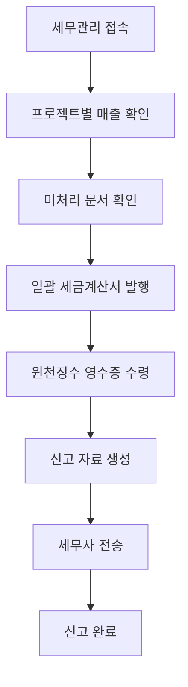

# 📋 Weave 페이지별 기능정의서

## 목차
1. [대시보드 (Dashboard)](#1-대시보드-dashboard)
2. [프로젝트 관리 (Projects)](#2-프로젝트-관리-projects)
3. [세무관리 (Tax Management)](#3-세무관리-tax-management)
4. [공통 컴포넌트](#4-공통-컴포넌트)
5. [데이터 연동 매트릭스](#5-데이터-연동-매트릭스)

---

## 1. 대시보드 (Dashboard)

### 1.1 페이지 목적
- 프리랜서의 비즈니스 현황을 한눈에 파악
- 긴급 처리 사항 즉시 인지
- 주요 지표 실시간 모니터링

### 1.2 주요 구성 요소

#### 1.2.1 요약 카드 (Summary Cards)
| 카드명 | 표시 데이터 | 연동 페이지 | 액션 |
|--------|------------|------------|------|
| 진행중 프로젝트 | 활성 프로젝트 수량 | 프로젝트 > 진행중 | 클릭 시 해당 탭 이동 |
| 이번달 예상 수입 | 당월 예상 매출액 | 세무관리 > 매출/매입 | 클릭 시 매출 상세 |
| 수금 예정 | 수금 예정 금액 및 D-day | 프로젝트 > 수금 관리 | 수금 상세 모달 |
| 미수금 | 지연된 수금 총액 | 프로젝트 > 미수금 목록 | 미수금 목록 팝업 |

#### 1.2.2 수금 현황 위젯
```markdown
기능 정의:
- 이번 주 수금 일정 표시
- 수금 단계별 상태 관리 (완료/대기/예정)
- 세무 처리 상태 통합 표시

상태별 액션:
- ✅ 완료: 입금 확인 및 세무 처리 완료 상태
- 🔔 대기: 청구서 발송, 세금계산서 발행 버튼
- ⏰ 예정: 알림 설정, 사전 준비

세무 연동:
- 세금계산서 발행 여부 실시간 표시
- 원천징수 대상 자동 식별
- 미처리 세무 경고 알림
```

#### 1.2.3 긴급 세무 처리 알림
```markdown
표시 조건:
- 입금 예정일 D-3 이내 세금계산서 미발행
- 원천징수영수증 3일 이상 미수령
- 신고 기한 임박 (D-7)

액션 버튼:
- [발행하기]: 세금계산서 즉시 발행
- [재요청]: 원천징수영수증 재요청
- [처리하기]: 세무 페이지로 이동
```

#### 1.2.4 오늘 할 일
```markdown
기능:
- 프로젝트 작업 + 세무 작업 통합 관리
- 우선순위 자동 설정
- 체크박스로 완료 처리

할 일 유형:
- 프로젝트: 마일스톤, 산출물 제출
- 세무: 세금계산서 발행, 영수증 정리
- 수금: 청구서 발송, 입금 확인
- 기타: 미팅, 메모
```

---

## 2. 프로젝트 관리 (Projects)

### 2.1 탭 구조
```
[진행중] [클라이언트] [견적/제안] [계약관리] [완료/보관]
```

### 2.2 진행중 프로젝트 탭

#### 2.2.1 프로젝트 카드
```markdown
표시 정보:
- 프로젝트명, 기간, 상태
- 진행률 (시각적 프로그레스 바)
- 수금 현황 (계약금/중간/잔금)
- 세무 처리 현황

세무 상태 표시:
- ✅ 완료: 해당 단계 세무 처리 완료
- ⏰ 대기: 처리 예정
- ⚠️ 긴급: 즉시 처리 필요

액션 버튼:
- [청구서 발송]: 청구서 생성 및 발송
- [세무 처리]: 세무 페이지로 이동 (프로젝트 필터 적용)
- [상세보기]: 프로젝트 상세 모달
```

#### 2.2.2 프로젝트 상세 모달
```markdown
구성 요소:
1. 기본 정보
   - 프로젝트명, 기간, 총 계약금액
   - 상태, 카테고리, 진행률

2. 탭 메뉴
   - 개요: 전체 현황
   - 문서: 관련 문서 목록
   - 수금: 수금 일정 관리
   - 파일: 첨부파일
   - 커뮤니케이션: 이력

3. 진행 상황
   - 단계별 진행률 (기획/디자인/개발/테스트)
   - 마일스톤 체크

4. 관련 문서
   - 견적서, 제안서, 계약서
   - 청구서, 세금계산서
   - 미팅노트
   - [문서 추가] 버튼

5. 수금 일정
   - 단계별 수금 상태
   - 세무 처리 연동
   - 입금 확인
```

### 2.3 클라이언트 관리 탭

#### 2.3.1 클라이언트 목록
```markdown
검색 및 필터:
- 텍스트 검색
- 상태 필터 (전체/활성/휴면/VIP)
- [+ 클라이언트 등록] 버튼

통계 대시보드:
- 전체 클라이언트 수
- 활성 프로젝트
- 총 거래액
- 평균 거래기간

테이블 컬럼:
- 클라이언트 정보 (회사명, 담당자, 연락처)
- 진행 프로젝트 수
- 총 프로젝트 수
- 총 거래액
- 최근 거래일
- [상세] 버튼

상태 태그:
- VIP: 주요 고객
- NEW: 신규 고객
- 휴면: 6개월 이상 미거래
```

#### 2.3.2 클라이언트 상세 모달
```markdown
기본 정보:
- 회사명, 담당자, 연락처, 이메일
- 사업자번호, 등급(VIP/일반)

거래 통계:
- 총 프로젝트 수
- 총 거래액
- 거래 기간
- 정시 지불률

프로젝트 이력:
- 진행중 프로젝트
- 완료 프로젝트 (평점 포함)
- 각 프로젝트 금액 및 기간

특이사항:
- 결제 패턴
- 선호사항
- 주의사항
```

### 2.4 견적/제안 탭

#### 2.4.1 견적 요청 관리
```markdown
견적 카드 정보:
- 클라이언트명
- 프로젝트 개요
- 예산 범위
- 응답 기한 (D-day)

상태 분류:
- NEW: 신규 요청
- 작성중: 견적서 작성 진행
- 발송완료: 응답 대기
- 승인: 계약 진행

액션 버튼:
- [견적서 작성]: 견적서 작성 페이지
- [AI 초안 생성]: AI 기반 견적 생성
- [템플릿 선택]: 저장된 템플릿 활용
```

### 2.5 계약관리 탭

#### 2.5.1 계약 단계별 관리
```markdown
1. 계약서 작성 필요 (빨간색)
   - 견적 승인되었으나 계약서 미작성
   - [계약서 작성] [AI 생성] 버튼

2. 계약서 작성중 (노란색)
   - 수금 조건 협의중
   - 작성 진행률 표시
   - [계속 작성] 버튼

3. 서명 대기중 (회색)
   - 전자서명 링크 발송 상태
   - 대기 일수 표시
   - [재발송] 버튼

4. 활성 계약 (초록색)
   - 정상 진행중 계약
   - [계약서 보기] 버튼
```

### 2.6 완료/보관 탭

#### 2.6.1 아카이빙 기능
```markdown
분류:
- 연도별/분기별 그룹핑
- 총 매출 표시

액션:
- [일괄 다운로드]: ZIP 압축 다운로드
- [세무 자료 내보내기]: 세무 신고용 데이터 추출
- [프로젝트 복원]: 완료 프로젝트 재활성화
```

---

## 3. 세무관리 (Tax Management)

### 3.1 탭 구조
```
[매출/매입] [세금계산서] [신고준비] [세무사연계]
```

### 3.2 매출/매입 탭

#### 3.2.1 매출 관리
```markdown
필터 옵션:
- 프로젝트별 필터
- 기간 선택 (월/분기/년)
- 세무 처리 유형 (세금계산서/원천징수)

매출 분류:
1. 세금계산서 발행 매출
   - 프로젝트 태그 표시
   - 수금 단계 표시
   - [프로젝트 보기] 링크

2. 원천징수 매출
   - 세율 구분 (3.3%/8.8%)
   - 실수령액 자동 계산
   - 원천징수영수증 상태

프로젝트별 매출 요약:
- 프로젝트별 매출액
- 세무 처리 상태
- 미처리 경고

액션 버튼:
- [매출 등록]: 수동 매출 입력
- [영수증 스캔]: OCR 자동 인식
- [엑셀 가져오기]: 일괄 업로드
```

#### 3.2.2 매입/경비 관리
```markdown
경비 분류:
- 사무용품
- 교통비
- 접대비
- 통신비
- 기타

자동 처리:
- 영수증 OCR 인식
- 항목 자동 분류
- 프로젝트별 경비 배분
```

### 3.3 세금계산서 탭

#### 3.3.1 세무 문서 통합 관리
```markdown
문서 유형 필터:
- 세금계산서
- 원천징수
- 현금영수증

처리 상태:
1. 처리 필요 (빨간색)
   - 프로젝트 태그
   - 금액 및 기한
   - [발행하기] [안내발송] 버튼

2. 처리 완료 (초록색)
   - 완료 일자
   - 문서 번호
   - [보기] [다운로드] 버튼

프로젝트 연동:
- 모든 문서에 프로젝트 태그
- 프로젝트 상세로 바로가기
- 수금 단계와 자동 연동
```

### 3.4 신고준비 탭

#### 3.4.1 통합 대시보드
```markdown
전체 진행 상황:
- 처리 완료 프로젝트 수
- 발행 대기 문서 수
- 신고 준비율

프로젝트별 체크리스트:
- 프로젝트명
- 세무 처리 진행률
- 미처리 항목 표시
- [상세] 버튼
```

#### 3.4.2 세무 신고 체크리스트
```markdown
부가가치세:
□ 매출 자료 정리
□ 매입 자료 정리
□ 세금계산서 발행
□ 영수증 정리

종합소득세:
□ 사업소득 정리
□ 필요경비 정리
□ 소득공제 자료
□ 세액공제 자료

자동 계산:
- 예상 납부세액
- 환급 예상액
- 절세 시뮬레이션
```

### 3.5 세무사연계 탭

#### 3.5.1 세무사 협업
```markdown
담당 세무사 정보:
- 세무사명, 사무소
- 연락처
- 담당 업무

전송 관리:
- 자료 패키징
- 암호화 전송
- 전송 이력

진행 상태:
- 접수
- 검토중
- 보완요청
- 완료

커뮤니케이션:
- 메시지 기능
- 파일 첨부
- 코멘트
```

---

## 4. 공통 컴포넌트

### 4.1 플로팅 액션 버튼 (FAB)
```markdown
메뉴 항목:
- 📝 프로젝트 생성
- 👤 클라이언트 등록
- 📄 청구서 발행
- 📸 영수증 스캔
- 💰 수금 등록
- 📋 메모 작성

동작:
- 클릭 시 퀵 메뉴 표시
- 각 항목 선택 시 해당 모달 오픈
```

### 4.2 하단 네비게이션
```markdown
구성:
[홈] [프로젝트] [세무] [더보기]

동작:
- 탭 선택 시 페이지 전환
- 현재 페이지 하이라이트
- 뱃지로 알림 수 표시
```

### 4.3 알림 시스템
```markdown
알림 유형:
1. 수금 알림
   - 수금 예정일 D-3
   - 미수금 발생
   
2. 세무 알림
   - 세금계산서 발행 필요
   - 신고 기한 임박
   
3. 프로젝트 알림
   - 마일스톤 도달
   - 클라이언트 메시지

알림 설정:
- 알림 유형별 on/off
- 알림 시간 설정
- 이메일/SMS 연동
```

---

## 5. 데이터 연동 매트릭스

### 5.1 프로젝트 ↔ 세무 연동

| 프로젝트 이벤트 | 세무 자동 생성 | 세무 알림 |
|---------------|--------------|----------|
| 계약 체결 | 계약금 세금계산서 대기 | 발행 알림 |
| 수금 단계 도달 | 해당 단계 세무 문서 생성 | D-3 알림 |
| 청구서 발송 | 세금계산서 발행 대기 | 즉시 알림 |
| 프로젝트 완료 | 잔금 세무 처리 | 완료 확인 |

### 5.2 세무 → 프로젝트 역연동

| 세무 이벤트 | 프로젝트 업데이트 | 상태 변경 |
|-----------|----------------|----------|
| 세금계산서 발행 | 수금 상태 '세무완료' | 🟢 |
| 원천징수 안내 | 프로젝트 메모 추가 | 🟡 |
| 영수증 미수령 | 경고 표시 | 🔴 |
| 신고 완료 | 프로젝트 아카이빙 가능 | ✅ |

### 5.3 클라이언트 ↔ 프로젝트 연동

| 클라이언트 정보 | 프로젝트 반영 | 자동 처리 |
|---------------|--------------|----------|
| 결제 패턴 | 수금 일정 제안 | 자동 설정 |
| 선호 세무 처리 | 세금계산서/원천징수 | 자동 선택 |
| VIP 등급 | 우선순위 설정 | 상단 표시 |
| 연체 이력 | 리스크 경고 | 알림 강화 |

---

## 6. 사용자 시나리오

### 6.1 신규 프로젝트 등록 → 세무 완료


### 6.2 월말 세무 정리


---

## 7. 기술 요구사항

### 7.1 데이터베이스 스키마
```sql
-- 주요 테이블 관계
Projects (1) ─── (N) Payments
Projects (1) ─── (N) TaxDocuments
Clients (1) ─── (N) Projects
Payments (1) ─── (1) TaxDocuments
```

### 7.2 API 엔드포인트
```markdown
프로젝트 API:
- GET /api/projects
- POST /api/projects
- PUT /api/projects/:id
- DELETE /api/projects/:id

세무 API:
- GET /api/tax/revenue
- POST /api/tax/invoice
- GET /api/tax/documents
- POST /api/tax/file

연동 API:
- POST /api/sync/project-tax
- GET /api/sync/status
```

### 7.3 실시간 업데이트
```markdown
WebSocket Events:
- payment.updated
- tax.document.created
- project.status.changed
- notification.new
```

---

이 기능정의서는 Weave 플랫폼의 모든 페이지와 기능을 상세히 정의하며, 프리랜서의 업무 흐름에 최적화된 통합 시스템을 구현하는 가이드라인을 제공합니다.